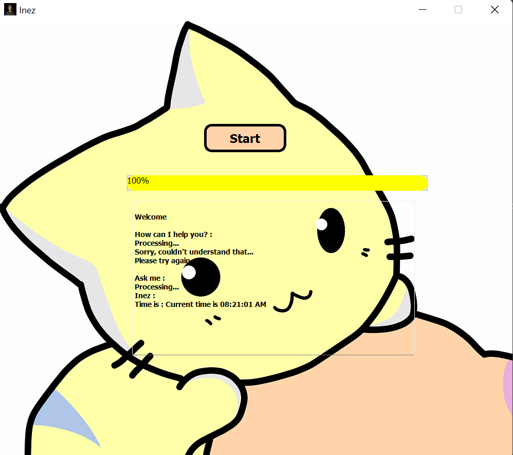

# Inez 
### A simple virtual assistant created using python, Machine Learning and NLP functions. Mimic basic functions of commercial virtual assistants like Alexa. Able to do simple tasks like setting reminders, searching the web, checking the weather, etc.
St. Edmunds College, Shillong
Made for final semester project.

##### Brief intro
Inez is a simple virtual assistant that can do simple tasks given by the user via voice. This program aims to develop a personal-assistant for Windows-based systems. Inez draws its inspiration from virtual assistants like Siri for iOS, Google assistant for android and Alexa from Amazon. It has been designed to provide a user-friendly interface for carrying out a variety of tasks by employing certain well-defined commands. Users can interact with the assistant through voice commands.

Inez assists the end-user with day-to-day activities like general human conversation, searching queries in Google, Wikipedia, searching for videos, retrieving images, live weather conditions, word meanings, playing music, do basic arithmetic calculations and reminding the user about the scheduled events and tasks. The user statements/commands are analysed with the help of machine learning to give an optimal solution

